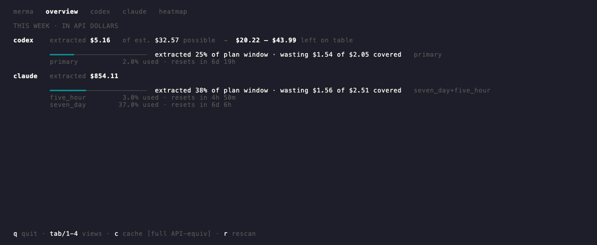
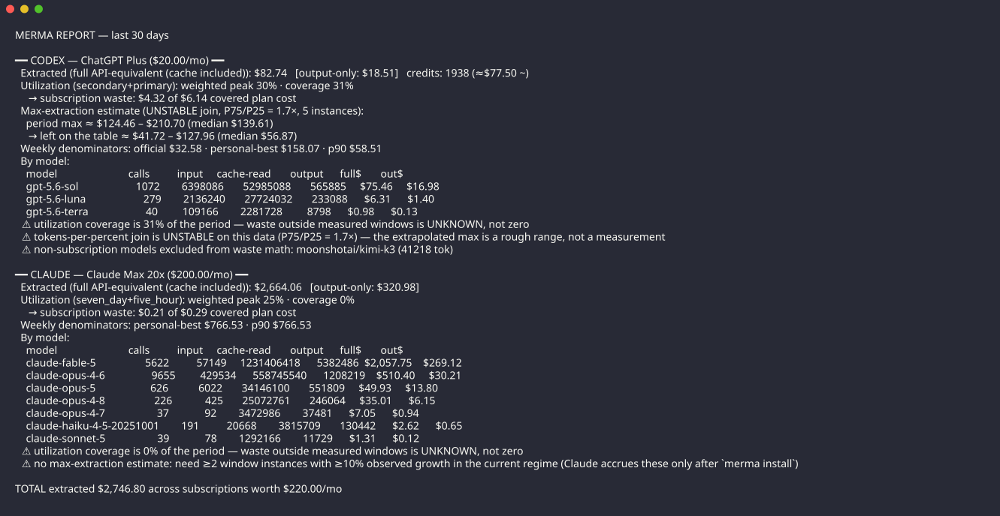
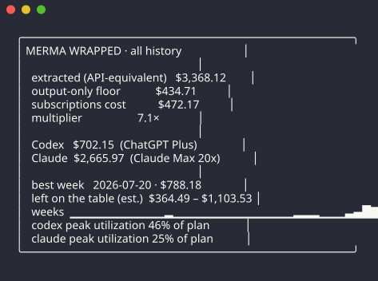

# merma

[](https://github.com/JairoTorregrosa/merma/actions/workflows/ci.yml)

*Merma* is the Spanish word for shrinkage: the part of a stock that is
lost before anyone uses it. This merma is a waste meter for AI
subscriptions. It measures what you extract from your Claude Code and
Codex plans, and what you leave on the table.



Everything runs locally. merma reads the logs that Claude Code and Codex
already write on your machine, prices every token at public API rates,
and compares the result against what your subscriptions cost. It has no
telemetry and sends nothing anywhere.

## What it answers

1. **Extracted** — the API-equivalent dollar value of your real usage,
   priced token by token from your local logs.
2. **Left on the table** — the value you could have extracted inside
   the billing windows you paid for, minus what you did.

Every figure states its own limits. Coverage below 100% prints next to
the waste it qualifies. An unstable estimate says UNSTABLE and shows a
range. An approximate price marks every figure it touches with `~`. A
floor renders as `≥`. merma never shows a number the data cannot
support.

## The report

`merma report --period 30d` is the retrospective view:



Read the label gutter top to bottom, per provider:

| Label | What it tells you |
|---|---|
| `extracted` | API-equivalent dollars for the period, plus the output-only floor. |
| `credits` | Codex credits spent, valued at the official rate card. |
| `utilization` | Peak use of your billing windows, and how much of the period those windows cover. |
| `waste` | The covered plan cost you did not use. |
| `period max` · `left on table` | What a fully-used window is worth, joined from your own tokens-per-percent history. A quartile range, never a point — labeled UNSTABLE when the join disperses. |
| `denominators` | The official weekly ceiling, your personal best, and your p90 week. |
| `by model` | Calls, tokens, and dollars per model. |
| `⚠` | Everything the numbers above cannot see. Waste outside measured windows is UNKNOWN, not zero. |

## The recap card

`merma wrapped --period all` prints a shareable card:



The multiplier is the honest one: the subscription cost integrates your
recorded plan history, not the current price times months.

## The doctor

`merma doctor` checks every data source and cross-checks merma's
reconstruction against the live endpoints:


A `✓` is a working source. A `⚠` names the problem and the remedy. The
cross-check compares the latest snapshot rebuilt from local files with
the live percentage — when they match, the ingestion path is proven
against the official numbers.

## The status line

`merma status` prints one line for scripts and status bars:

```
codex primary 21% (resets 3h 34m) · claude five_hour 56% (resets 2h 41m) · claude seven_day 26% (resets 6d 14h)
```

Every command also takes `--json` for machine-readable output.

## How it measures

- **Claude transcripts** re-emit ~57% of assistant entries. merma dedups
  by `message.id` + `requestId`. Without this rule every figure would
  double.
- **Codex rollout counters** are cumulative per file. merma diffs
  consecutive values and detects baseline resets.
- **Billing windows come from data.** merma reconstructs window
  instances from `resets_at` moves, percent drops, plan changes, and
  regime changes. When Codex switched its primary window from 300
  minutes to weekly, merma detected it from the files.
- **Estimates scale by measured time only.** The measured span is an
  interval union. A gap between two measured stretches is never scaled
  over.
- **Each covered stretch is priced at its own plan.** A month on a
  cheaper plan is priced at that plan, even after you switch back.

[VERIFICATION.md](VERIFICATION.md) records the empirical evidence for
each of these claims, including two external review rounds.
[DESIGN.md](DESIGN.md) states the rules that keep them true.

## Data sources

| Source | Provides | How |
|---|---|---|
| `~/.claude/projects/**.jsonl` | Claude tokens per call | incremental scan |
| `~/.codex/sessions/**` | Codex tokens, snapshots, plan | incremental scan |
| statusline hook | Claude utilization history | each render |
| Codex wham endpoint | live utilization, credits | poll, ≥ 60 s |
| Claude OAuth endpoint | live utilization | poll, ≥ 120 s, opt-out |

The statusline hook and the local files are the sanctioned path. The
Claude OAuth poller is unofficial: it reuses the token your local Claude
Code already holds, polls gently, and turns off with one config line:

```toml
# ~/.merma/config.toml
claude_oauth_enabled = false
```

merma works without it; the hook keeps collecting utilization while
Claude Code runs.

## Install

### From source

```sh
git clone https://github.com/JairoTorregrosa/merma
cd merma
./install.sh
```

The script builds the binary, installs it to `~/.local/bin/merma`, shows
a preview of the hook install, and asks before it changes anything.

### From a release

Download the archive for your platform from
[Releases](https://github.com/JairoTorregrosa/merma/releases), verify it
against `SHA256SUMS`, and unpack the binary into your `PATH`. Then run
`merma install`.

### With an agent

Tell your coding agent:

> Install merma from https://github.com/JairoTorregrosa/merma following
> AGENTS.md.

[AGENTS.md](AGENTS.md) gives the agent preconditions to verify, exact
steps, postconditions, and prohibitions.

### What `merma install` changes

1. Sets `statusLine` in `~/.claude/settings.json` to the merma hook. It
   writes a backup first and prints the rollback path. Your previous
   statusline keeps rendering — merma chains to it.
2. Offers `--fix-retention` to raise `cleanupPeriodDays` to 365, so
   your history stops evaporating after 30 days.
3. With `--launchd` (macOS), installs a background collector that runs
   `merma collect --quiet` every 15 minutes.

`merma uninstall` restores the previous statusline. `merma install
--print` shows every change without making it.

## Configuration

`~/.merma/config.toml`, all keys optional:

| Key | Meaning |
|---|---|
| `chain_statusline` | command whose output the hook passes through |
| `claude_plan_id` | override the detected Claude plan |
| `claude_monthly_usd` | override the Claude plan price |
| `codex_monthly_usd` | override the Codex plan price |
| `claude_oauth_enabled` | `false` disables the OAuth poller |
| `oauth_poll_secs` | OAuth poll cadence (min 120) |
| `wham_poll_secs` | Codex poll cadence (min 60) |

Prices live in [prices.toml](prices.toml): dated tables per model
prefix, with validity windows per era. Retired-era prices that lack an
official source are marked `approx = true`, and every dollar they touch
renders with `~`. Drop a corrected table at `~/.merma/prices.toml` to
override without rebuilding.

## Performance

A full first scan of ~1.3 GB of history takes about 4 s. An incremental
rescan takes under 0.1 s. The statusline hook adds one spool append per
render. The database is a single SQLite file at `~/.merma/merma.db`.

## Development

```sh
cargo test
cargo clippy --all-targets -- -D warnings
cargo fmt --check
```

CI runs all three plus a release build on Linux and macOS. The screens
in this README are real output, captured with
[freeze](https://github.com/charmbracelet/freeze) and
[vhs](https://github.com/charmbracelet/vhs); `assets/dashboard.tape`
rebuilds the GIF.

## Governance

Agent-mediated contributions are welcome and reviewable.
[GOVERNANCE.md](GOVERNANCE.md) explains the rules; [agm.json](agm.json)
encodes them; the `AGM` check enforces them on every pull request. The
short version: state what you verified, declare what you did not, and a
human takes responsibility for every risky change.

## Releases

Tags matching `v*` build binaries for Linux and macOS (x86_64 and
aarch64), attach them to a GitHub release with a `SHA256SUMS` file, and
generate notes.

## License

MIT or Apache-2.0, at your option.
