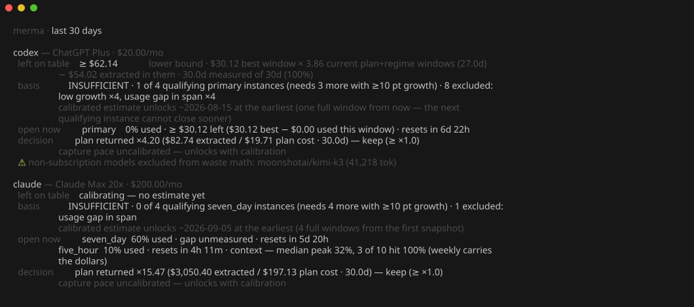
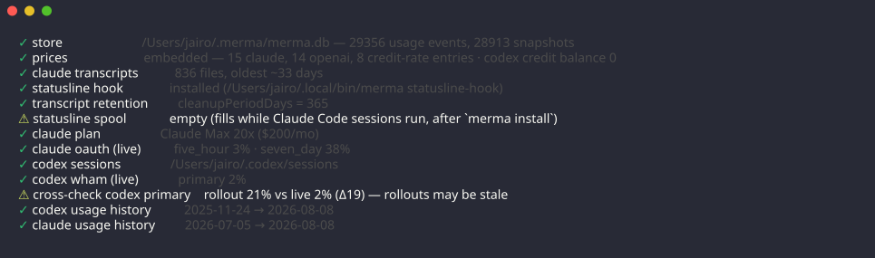

# merma

[](https://github.com/JairoTorregrosa/merma/actions/workflows/ci.yml)

*Merma* is the Spanish word for shrinkage: the part of a stock that is
lost before anyone uses it. merma measures the dollars you leave on the
table in the AI subscriptions you pay for.



Everything runs locally. merma reads the logs that Claude Code and Codex
already write on your machine, prices every token at public API rates,
and estimates — from your own utilization history — the dollar value of
the window capacity you do not use. It has no telemetry and sends
nothing anywhere.

## The brief

`merma` prints one screen with a stanza per provider. Four lines
answer four questions:

| Line | What it answers |
|---|---|
| `left on table` | Over the period, how many dollars of window capacity went unused. A range with a stated basis, never a point, never fabricated. |
| `basis` | Where the number comes from: the confidence tier, the instance count, the achieved coverage, the gates that excluded instances, and whichever of floor / band / quantization dominates. |
| `open now` | The live gap: how much capacity remains in the open window(s), in dollars, and the time left to use it. |
| `decision` | What the plan returned at your achieved pace, against the printed `keep ≥ ×1.0` threshold, and what capturing the gap would take. |

Symbols carry exact meanings:

| Symbol | Meaning |
|---|---|
| `≈ a – b` | Calibrated band with its achieved coverage printed beside it. |
| `≥` | Certified lower bound (a measured week or a 100% window is the bound). |
| `~` | An approximate price touched this figure. |
| `unmeasured` | The data cannot support a number. Never rendered as $0. |

`merma --period 90d` and `merma --provider codex` parameterize the
brief. The default period is 30 days.

## How the estimate is made

1. merma reconstructs billing-window instances from official
   `used_percent` snapshots. Windows come from data, never constants.
2. Each closed instance of the operative window joins observed percent
   growth to the dollars extracted inside the same span. Four admission
   gates reject instances that would bias the rate: growth below 10
   points, unpriced usage, usage-event holes, snapshot staleness. Every
   exclusion is counted and named in the basis.
3. The per-window value is the median of the qualifying instance rates.
   The band is the exact distribution-free order-statistic interval for
   the median; its achieved coverage prints exactly (93.75%, never
   "about 90%"). Integer quantization of `used_percent` widens the band
   as a strict outer bound. The band covers the typical window. It does
   not predict the next window.
4. Your best achieved week (or a window that reached 100%) is a
   certified floor. It composes by max with every lower edge and never
   tightens an upper edge. A `≥` figure scales only over measured time
   under your current plan and regime — the brief prints that
   arithmetic in full so you can redo it.
5. A confidence tier states what the number is:
   - **MEASURED** — the floor reached or passed the calibrated median;
     figures render `≥`.
   - **CALIBRATED** — at least 4 qualifying instances and no single
     instance moves the median more than 25%.
   - **INSUFFICIENT** — anything else. The brief prints exactly what is
     missing and the date calibration unlocks. No fabricated number.

## Cold start

Claude accrues utilization history only after `merma install` wires the
statusline hook. Until 4 instances qualify, the brief shows the
INSUFFICIENT tier: how many instances are missing and the earliest
unlock date. Keep the hook installed and use the windows; the date moves
closer with every full cycle you let merma observe.

## Install

### From source

```sh
git clone https://github.com/JairoTorregrosa/merma
cd merma
./install.sh
```

The script builds the binary, installs it to `~/.local/bin/merma`, shows
a preview of the hook install, and asks before it changes anything.

### From a release

Download the archive for your platform from
[Releases](https://github.com/JairoTorregrosa/merma/releases), verify it
against `SHA256SUMS`, and unpack the binary into your `PATH`. Then run
`merma install`.

### With an agent

Tell your coding agent:

> Install merma from https://github.com/JairoTorregrosa/merma following
> AGENTS.md.

[AGENTS.md](AGENTS.md) gives the agent preconditions to verify, exact
steps, postconditions, and prohibitions.

### What `merma install` changes

1. Sets `statusLine` in `~/.claude/settings.json` to the merma hook. It
   writes a backup first and prints the rollback path. Your previous
   statusline keeps rendering — merma chains to it.
2. Offers `--fix-retention` to raise `cleanupPeriodDays` to 365, so
   your history stops evaporating after 30 days.
3. With `--launchd` (macOS), installs a background collector that runs
   `merma collect --quiet` every 15 minutes.

`merma uninstall` restores the previous statusline. `merma install
--print` shows every change without making it.

## Plumbing subcommands

| Command | Does |
|---|---|
| `merma scan` | Incremental ingest of local history. |
| `merma collect` | Scan + live polls (the launchd agent runs this). |
| `merma status` | The live gap's smallest form, one line. |
| `merma doctor` | Diagnoses every data source, including the calibration state per provider. |

## The status line and the live view

`merma status` prints one line for scripts and status bars:

```
codex primary 0% · ≥$30 left · resets 6d 22h | claude seven_day 59% · gap unmeasured · resets 5d 20h | claude five_hour 2% · resets 4h 51m
```

Piped output is byte-plain, so the live view is free:

```sh
watch -n 300 merma
```

## The doctor

`merma doctor` checks every data source with a concrete remedy per
problem, cross-checks merma's reconstruction against the live endpoints,
and reports the calibration state per provider (tier, qualifying
instances, exclusions by gate, unlock date).



## `--json`

`merma --json` (and `merma status --json`) emit schema `0.2.0`. This is
a breaking change from the 0.1.x report shape; fields may only grow
within a schema version.

Rules:

- Every estimated dollar figure (`left_on_table_usd`, `gap_usd`) is a
  tagged object — `{"kind": "band", lo, med, hi, coverage, n, approx}`
  or `{"kind": "floor", low, approx}` — never a bare float. Exact
  measured operands (extracted dollars, plan cost, the floors and
  bounds in the basis) are plain numbers: they carry no uncertainty to
  tag.
- An unknown estimated dollar is `null` plus a sibling reason
  (`gap_usd: null` + `gap_reason`; a null headline's reason lives in
  `basis.insufficient`). Never zero.
- Achieved coverage is the exact fraction (`0.9375`).
- Every number in the text exists in the JSON with the same value; the
  text formats it (a test pins this).

Removed relative to 0.1.x: `by_model`, `credits*`, `denominators`,
`weekly_series`, `windows[].instances`, `weighted_peak_pct`,
`utilization`, `output_only_usd`, `cache_mode`. The `0.1.x` top-level
report array is replaced by `{schema_version, generated_at, period,
providers[]}`.

## How it measures

- **Claude transcripts** re-emit ~57% of assistant entries. merma dedups
  by `message.id` + `requestId`. Without this rule every figure would
  double.
- **Codex rollout counters** are cumulative per file. merma diffs
  consecutive values and detects baseline resets.
- **Billing windows come from data.** merma reconstructs window
  instances from `resets_at` moves, percent drops, plan changes, and
  regime changes. When Codex switched its primary window from 300
  minutes to weekly, merma detected it from the files.
- **Estimates scale by measured time only.** The measured span is an
  interval union. A gap between two measured stretches is never scaled
  over.
- **Each covered stretch is priced at its own plan.** A month on a
  cheaper plan is priced at that plan, even after you switch back.

[VERIFICATION.md](VERIFICATION.md) records the empirical evidence for
each of these claims. [DESIGN.md](DESIGN.md) states the rules that keep
them true, including the estimator doctrine and its rejected
alternatives.

## Limits, honestly

- Calibration uses at most 8 instances; the bands are wide because the
  truth at that sample size is wide.
- The only distributional assumption is exchangeability of instances.
- Price drift across eras is handled by recency (newest instances
  first), not by trend modeling.
- Quantization error is propagated as a worst-case outer bound, not
  averaged away.

## Data sources

| Source | Provides | How |
|---|---|---|
| `~/.claude/projects/**.jsonl` | Claude tokens per call | incremental scan |
| `~/.codex/sessions/**` | Codex tokens, snapshots, plan | incremental scan |
| statusline hook | Claude utilization history | each render |
| Codex wham endpoint | live utilization | one poll per `merma collect` (launchd: every 15 min) |
| Claude OAuth endpoint | live utilization | one poll per `merma collect` (launchd: every 15 min), opt-out |

The statusline hook and the local files are the sanctioned path. The
Claude OAuth poller is unofficial: it reuses the token your local Claude
Code already holds, polls only when `merma collect` runs (every 15
minutes under the launchd agent), and turns off with one config line:

```toml
# ~/.merma/config.toml
claude_oauth_enabled = false
```

merma works without it; the hook keeps collecting utilization while
Claude Code runs.

## Configuration

`~/.merma/config.toml`, all keys optional:

| Key | Meaning |
|---|---|
| `chain_statusline` | command whose output the hook passes through |
| `claude_plan_id` | override the detected Claude plan |
| `claude_monthly_usd` | override the Claude plan price |
| `codex_monthly_usd` | override the Codex plan price |
| `claude_oauth_enabled` | `false` disables the OAuth poller |

Prices live in [prices.toml](prices.toml): dated tables per model
prefix, with validity windows per era. Retired-era prices that lack an
official source are marked `approx = true`, and every dollar they touch
renders with `~`. Drop a corrected table at `~/.merma/prices.toml` to
override without rebuilding.

## Performance

A full first scan of ~1.3 GB of history takes about 4 s. An incremental
rescan takes under 0.1 s. The statusline hook adds one spool append per
render. The database is a single SQLite file at `~/.merma/merma.db`.

## Development

```sh
cargo test
cargo clippy --all-targets -- -D warnings
cargo fmt --check
```

CI runs all three plus a release build on Linux and macOS. The screens
in this README are real output, captured with
[freeze](https://github.com/charmbracelet/freeze).

## Governance

Agent-mediated contributions are welcome and reviewable.
[GOVERNANCE.md](GOVERNANCE.md) explains the rules; [agm.json](agm.json)
encodes them; the `AGM` check enforces them on every pull request. The
short version: state what you verified, declare what you did not, and a
human takes responsibility for every risky change.

## Releases

Tags matching `v*` build binaries for Linux and macOS (x86_64 and
aarch64), attach them to a GitHub release with a `SHA256SUMS` file, and
generate notes.

## License

MIT or Apache-2.0, at your option.
